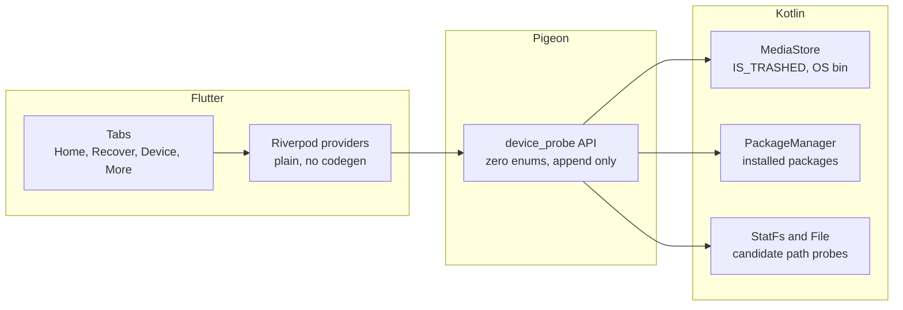
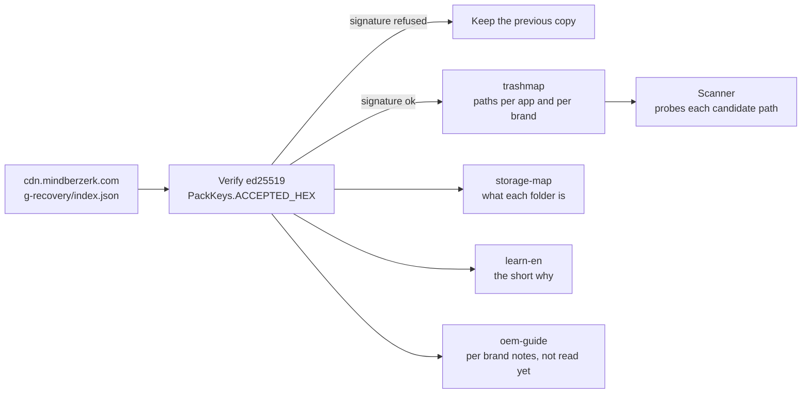
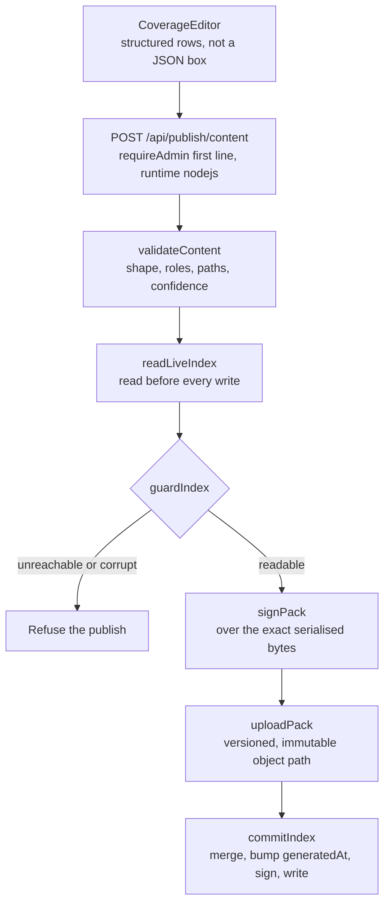
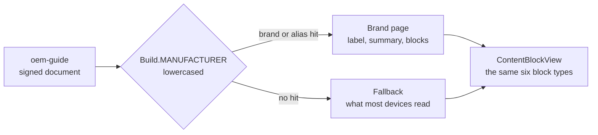

# G Recovery

Two questions, and they have different answers. What runs on the phone, and how
content reaches it without a Play release.

The second one is the reason this app has a panel at all. Nobody here owns a
Tecno, an Infinix, or half the devices in the install base, so every trash path
for those phones is a guess made from a laptop. Shipping a guess as a signed
document instead of as an APK turns a two week release cycle into a two minute
edit, and turns a wrong guess into one wasted stat call instead of a rollback.

## On the device

Flutter holds state and draws. Kotlin does everything that touches storage,
because `MediaStore`, `PackageManager` and `StatFs` have no Dart equivalent
worth maintaining, and because a scan that blocks the platform thread is a scan
that gets the app killed.

### Device tiers

`minSdk = 30` cost 6,932 devices and 48 live installs at the last release, and
Play named exactly one reason: `Doesn't support framework version, 30 and
onwards`. So the floor comes down to **24**, and the API 30 features become a
tier rather than a gate.

The tiers are not better and worse, they are different, which is the part worth
knowing before writing any of it:

| API | Shared storage | Android/data trash | OS bin |
|---|---|---|---|
| 24 to 28 | full, via `WRITE_EXTERNAL_STORAGE` | readable directly | absent |
| 29 | scoped, no all files access | not readable | absent |
| 30 and up | `MANAGE_EXTERNAL_STORAGE` | closed, needs the user | `IS_TRASHED` |

Old phones are not a degraded experience. They have the WEAKEST platform
recovery and the STRONGEST file access, because Android 11 is what closed
`Android/data` to direct reads. The per app trash folders in the map are more
reachable on a 2017 Huawei than on a 2024 Samsung.

API 29 is the genuinely thin tier: scoped storage is enforced, `IS_TRASHED` does
not exist, and `MANAGE_EXTERNAL_STORAGE` does not exist either. It gets
MediaStore and whatever the user grants through a document tree.

Capability is reported once by `device_probe` and read by the UI, so no screen
computes its own answer from `Build.VERSION.SDK_INT`. A feature that is absent
renders as absent rather than as a button that fails.

The Pigeon schema carries no enums, deliberately. Codec ids start at 129 and are
assigned in declaration order, so appending a class is always safe and inserting
one renumbers everything below it. Fields and methods go at the END, never in
the middle.

## How content reaches a device

Everything the app knows about other people's phones is data, not code. A new
manufacturer ships as a document, and a device that cannot verify a document
keeps the one it already trusted.

Refusing loudly and keeping the old copy is the whole safety argument. The first
index this pipeline ever signed was signed with the wrong key, publish reported
success, the JSON was valid, and every device silently showed an empty
catalogue. `assertTrustedKey` now signs a probe and verifies it against the
public key devices actually hold, before anything real is signed.

Paths are candidates and are never checked for existence at publish time. The
scanner stats each one and reports only what it finds, so a wrong path costs one
syscall. What IS checked is shape: a leading slash or a `..` would be dropped by
the app's own parser, and a typo that quietly reduces coverage is the hardest
kind of mistake to notice from a laptop.

Each rule can carry a `confidence` of `verified` or `reported`, or leave it
absent. The scanner treats all three identically. It exists because a path
reproduced on the Samsung on the desk and a path copied off a forum look the
same in a JSON file, and the app should not imply a result it has never seen.

## How content gets published

One path in, and only one. There were two once and they disagreed about a
directory, which orphaned objects invisibly for months.

Read, merge, bump, sign, write. Never build the next index from something the
panel remembered: a publish is additive, and anything published by the CLI or by
a second admin would otherwise be silently dropped, which looks to a user like
packs vanishing from a store while remaining installed.

`generatedAt` must strictly increase or every device that has already synced
ignores the new index without reporting anything. Pack versions are monotonic
integers and the version is in the object path, so every object is immutable and
cacheable for a year.

The signature covers the exact bytes that are uploaded. Never re-stringify a
manifest before signing, because any JSON round trip reorders keys and the
signature then verifies nothing.

## The storage map

Seven chapters about how Android storage works is a manual, and nobody opens a
manual on a phone. The same knowledge attached to the folder a person is
standing in is a label they cannot avoid reading, so most of Learn's job moved
into a document keyed by path.

Each folder carries a label, what its name stands for when the name is an
acronym, who put it there, and one required field:

| `recoverable` | meaning |
|---|---|
| `trash` | goes somewhere recoverable, and the trashmap says where |
| `cache` | regenerated, so losing it costs nothing |
| `none` | gone, and no scan will find it |

That field is the join between this document and the trashmap, and it is why
the map is a registry rather than an article: it is looked up by path at the
moment a question occurs, not read front to back. DCIM stands for Digital Camera
Images, named for a standard from when phones pretended to be cameras so
computers would recognise them. `Android/data/com.whatsapp` is not a folder
anyone chose. It is a package name, and the app writes there because the system
gave it nowhere else.

A folder row is an icon, a name, what the name stands for, and one line of at
most seventy characters, refused at publish rather than warned about. There is
no block list: the app is built so a person taps an icon or opens a folder
instead of reading, and a field that grows invites writing until it stops
looking empty. The icon comes from a closed set of twelve, because an icon that
means something different in two places means nothing in either.

Sizes are never published here. The app measures them; this supplies the words.

What survives in Learn is the reading with nowhere else to live: why a deleted
file is sometimes gone for good, what a preview quality recovery is, and why the
answer depends on an Android version. It is reached from an info icon at the
moment a verdict is delivered. Keeping it short is not tidiness: two screens
explaining storage will disagree within a month, and the wrong one will be
whichever nobody remembered to edit.

## Brand guidance

Recovery behaviour diverges by OEM skin far more than by API level. Two phones
on the same Android 13 disagree about whether the gallery keeps a bin, how long
it holds it, and whether a cloud sync has already removed the copy the user is
looking for. None of that is derivable from a version number, so it is written
per manufacturer.

The block vocabulary is borrowed from the Learn guide rather than invented, so
the device renders guidance with a screen it already has. A vocabulary of its
own would have meant a second renderer and a second way for published content to
draw wrong on a stranger's phone.

Brand keys are lowercase because `Build.MANUFACTURER` is lowercased before the
comparison, and a capital letter would match nothing while looking correct in
the panel. Aliases exist because the same maker ships more than one string:
`tecno` and `tecno mobile limited` are one company and two ROMs.

The fallback is the common case, not the edge case. The install base is a long
tail of manufacturers nobody will write a page for, and without a fallback those
devices get an empty screen, which reads as a broken app rather than as an
absence of advice.

## What the panel screens map to

| Screen | Reads | Writes |
|---|---|---|
| Overview | live index, published trashmap, Play reports, GA4 | nothing |
| Coverage | published trashmap | `registries/trashmap/vN` |
| Storage | published storage-map | `registries/storage-map/vN` |
| Learn | published learn-en | `articles/learn-en/vN` |
| Brand guidance | published oem-guide | `guides/oem-guide/vN` |
| Architecture | this file | nothing, deliberately |

This document is rendered from the repo rather than edited in a form, so a
change to the diagrams appears in the same diff as the change they describe. A
diagram that has drifted is worse than no diagram, because it is trusted.
