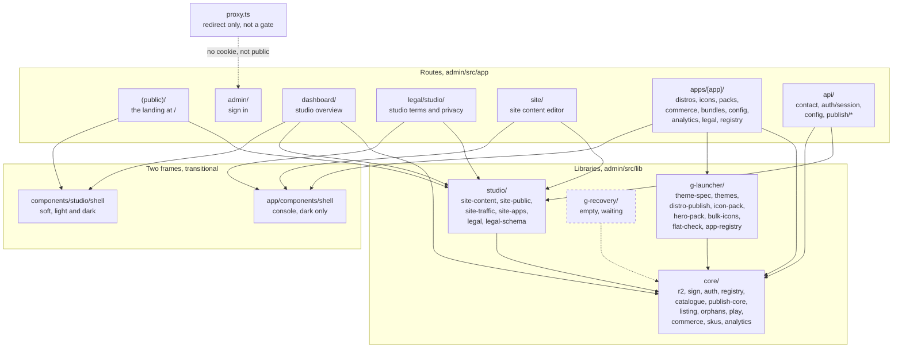
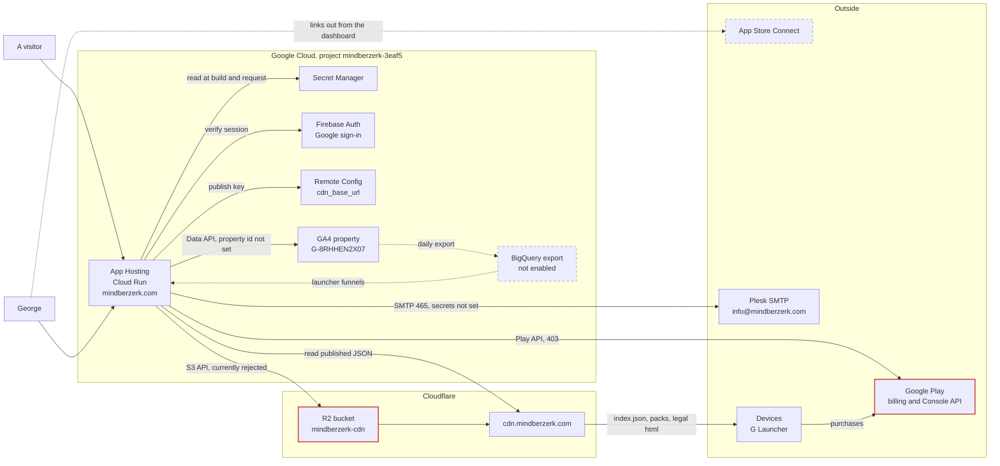
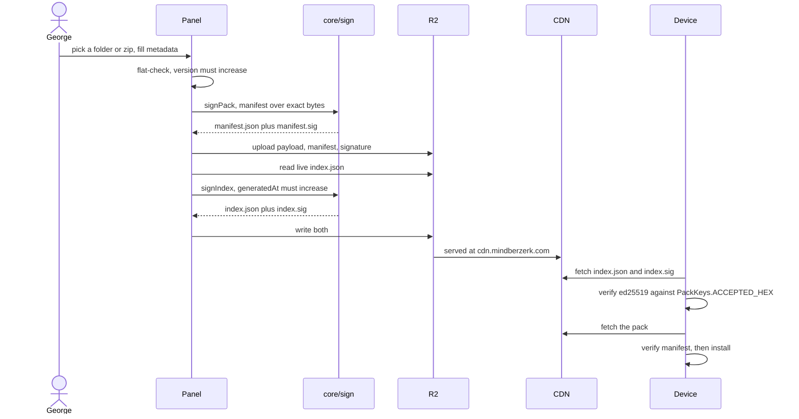
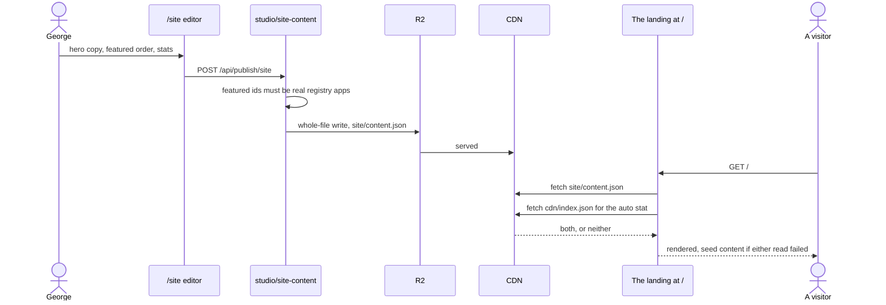
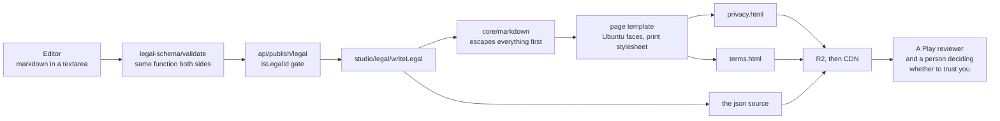
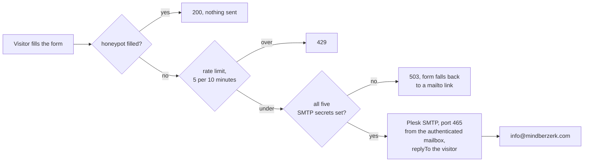

# Admin panel and public site, architecture

One Next.js application on Firebase App Hosting serves two audiences from one
origin: `mindberzerk.com` for anyone, and the console behind a UID allowlist.

Everything below is Mermaid inside markdown, on purpose. It renders on GitHub,
it shows up in a diff when it changes, and there is no exported image to go
quietly out of date.

Read the three in order. The first says what the code is, the second says what
it runs on, the third says what moves between them.

---

## 1. Component architecture

What lives where, after the `lib/` reorganisation.

**The one rule the folders encode.** Arrows point down: `g-launcher` and
`studio` may use `core`, and `core` may use neither. The day `core` imports
something out of `g-launcher`, the split has stopped meaning anything, and
G Recovery starts inheriting launcher concepts it does not have.

**The two shells are a to-do, not a design.** The dashboard is soft and
everything else is the dark console, so clicking into an app crosses a visible
seam. The restyle closes it by making `--color-surface-*` and `--color-ink*`
mode-aware in `globals.css`, which converts every screen without editing a
screen file, after which one of these two files is deleted.

**`proxy.ts` is a redirect, never a boundary.** It runs on the Edge runtime,
which cannot run firebase-admin, so it can see whether a cookie exists and
nothing more. Every route and server component that touches the signing key,
R2, or anything non-public calls `requireAdmin()` itself.

---

## 2. Infrastructure

What runs where, and which secret unlocks it.

**Secrets, and what each one costs if it leaks.** `pack-signing-key` is the
ed25519 private half whose public counterpart is compiled into every shipped
APK; if it reaches a browser, every signature in the ecosystem is worthless and
the fix is a Play release plus a key rotation on every device. `admin-uids` is
an allowlist rather than a role check, and a credential rather than a setting,
because this panel can write to the CDN every installed launcher trusts. None
of them carries a `NEXT_PUBLIC_` prefix, which is the single mistake that would
make the whole scheme decorative.

**Currently broken, marked red.** R2's S3 token is rejected on every probe,
which blocks the panel but not publishing, since `wrangler` uses account OAuth
on a different auth path. The Play Console API returns 403 until the service
account invite is accepted.

**Not switched on, marked dashed.** The BigQuery export, which is what
`lib/core/analytics.ts` needs for launcher funnels and retention. App Store
Connect is a link target only; nothing reads it.

---

## 3. Data flow

Four flows, because they have genuinely different shapes and different
consequences when they fail.

### 3a. Publishing a pack, the signed path

The only flow a phone verifies.

**The invariants that bite.** The signature covers the exact serialised bytes,
so a manifest that is parsed, modified and re-stringified verifies in the editor
and fails with BadSignature on every device. `generatedAt` must exceed what is
live, which is what stops a stale edge or a replay hiding an update forever. A
`theme.json` whose `id` differs from its `packId` inherits the bundled theme's
preferences bucket and silently fails to apply its wallpaper.

### 3b. Site content, the unsigned path

No device reads this, so nothing is signed.

**Why the landing reads the CDN rather than R2.** The panel writes with S3
credentials that are currently rejected. A public page must render anyway, and
should be cacheable at the edge, so it reads the same document over the public
CDN with no credential involved. One writer, two readers, two audiences.

### 3c. Legal documents, markdown in and HTML out

**Source is written last, deliberately.** If the HTML writes fail halfway, the
stored source still describes what is live rather than what was intended, and
pressing publish again is a clean retry.

**Four ids, one pipeline.** `studio`, `g-launcher`, `g-recovery` and any future
app render through the same template. `studio` is reserved rather than an app,
so `APPS` stays a closed tuple and nothing else starts treating the studio as
something with a bucket prefix.

### 3d. Contact, the one write that leaves the estate

**Degrades rather than breaks.** A missing secret must not read as a user
error, so an unconfigured route answers 503 and the section keeps working
through a mailto link. Cloud Run permits outbound 465 and 587; only port 25 is
blocked, and nothing here uses it.

---

## Keeping this honest

A diagram that has drifted is worse than no diagram, because it is trusted.
Three habits keep it true:

- When a `lib/` file changes bucket, edit section 1 in the same commit.
- When a secret or a service is added, edit section 2 in the same commit.
- When a flow gains a step that can fail, edit section 3, and say what the
  failure looks like rather than only that it can happen.

Per-app documents live beside this one as `docs/<app>/architecture.md`, with the
same three sections. The launcher's will differ most in section 3, where the
interesting flows are on-device rather than in a browser: pack verification,
the icon cache fingerprint, and the preference buckets a theme resolves through.
