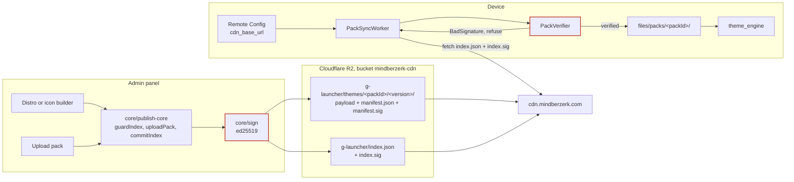
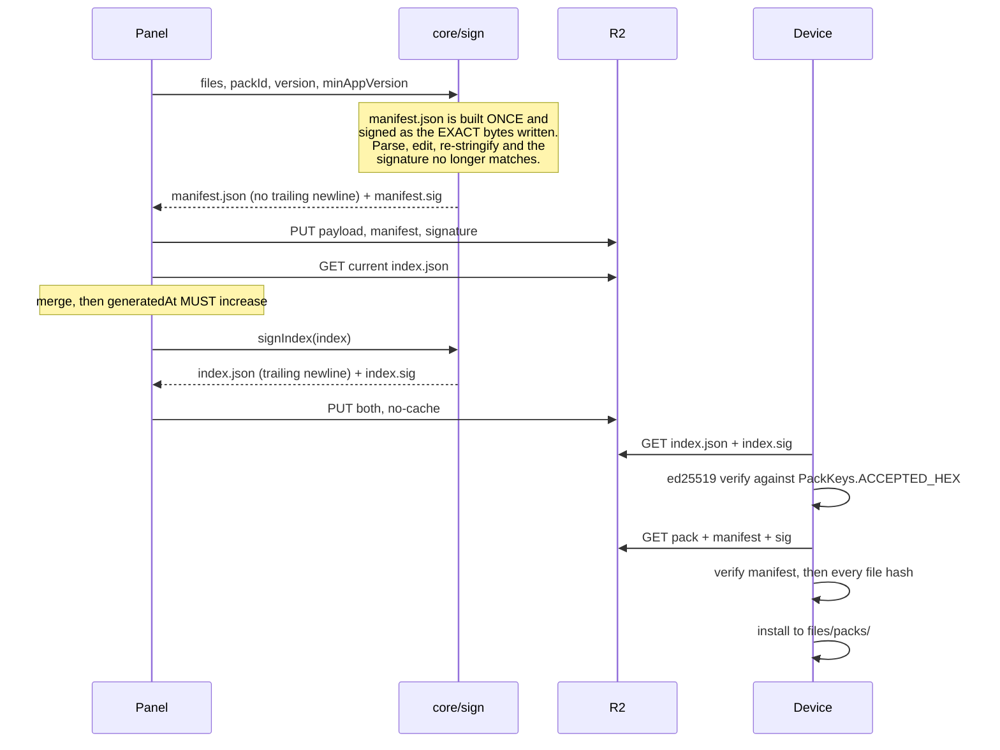
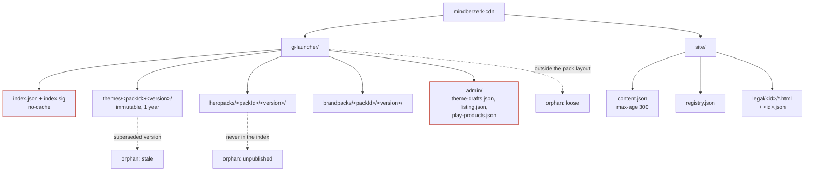

# G Launcher, architecture

Two systems meet in this document. The panel is Next.js and TypeScript; the
launcher is Flutter, Dart and Kotlin. They share no code. What they share is a
**file format and a signature**, and almost every failure either one can have is
a disagreement about that format.

Mermaid inside markdown, so it renders on GitHub and changes in a diff.

> **Scope, stated up front.** Sections 1 to 3 describe the delivery pipeline and
> are written from the panel's source, which owns the writing half of every
> contract here: `lib/core/sign.ts`, `catalogue.ts`, `pack-content.ts`,
> `cdn.ts`, `publish-core.ts`, `unpublish-core.ts` and `orphans.ts`. Section 4
> is the on-device architecture and is deliberately a **stub**: it needs the
> Flutter and Kotlin sources listed there, and a diagram of code nobody has read
> is worse than no diagram, because it will be believed.

---

## 1. The delivery pipeline

What happens between pressing publish and a phone drawing a new desktop.



**The two signatures are separate and both are required.** `index.sig` covers
the catalogue; `manifest.sig` covers one pack's file list and every sha256 in
it. A pack with a valid manifest inside an unsigned index is invisible, because
the device rejects the index before it ever looks at a pack. That asymmetry is
why `IndexResult.Rejected` and "nothing changed" return the same `false` from
`refreshCatalogue`, and why an unsigned index is the loudest banner in the
panel.

**Version is a monotonic integer, and the disk cache is keyed by pack id, not by
version.** So republishing at the same number changes the bytes in the bucket
and nothing on any phone, while reporting success everywhere. This is the single
most expensive misunderstanding available in this system, which is why the panel
prefills the next version from the live index and refuses to render its builders
when that index cannot be read.

---

## 2. The signing contract

The exact bytes, because every one of these has cost real time.



**Invariants, do not re-derive:**

- `manifest.json` has **no** trailing newline. `index.json` **does**. Both are
  signed as written.
- `generatedAt` must exceed what is live, which is what stops a stale edge or a
  replay hiding an update forever.
- `PackPaths.installedFile` refuses slashes, so every asset reference inside a
  downloaded pack must be a **bare filename**. A nested reference with a flat
  file renders fine; a bare reference with a nested file goes black.
- `theme.json`'s `id` **must equal** the `packId`, or the pack inherits the
  bundled theme's preferences bucket and its `wallpaperAppliedFor` key, and the
  wallpaper branch is skipped entirely.
- The public key hex in `PackKeys.ACCEPTED_HEX` is real despite the
  "PLACEHOLDER VALUE" comment beside it. Verified against the live `index.sig`.
- Pigeon codec ranges are isolated: `launcher_api` uses 129 to 134,
  `pack_api` has its own 129 to 132. Enums are numbered before classes, so a
  third enum in `launcher_api` would renumber every existing class and silently
  break the wire format. Use a string instead, as `brandTreatment` does.

---

## 3. Objects on the bucket

What lives where, and which of it is safe to delete.



**Unpublish is a delisting, not a delete.** It removes the entry from the index
so no new device discovers the pack; the objects stay, so a device already
mid-download finishes rather than failing an install. Those leftovers become
orphans, which is the deliberate second half of the design: reviewed, grouped by
kind, and removed only on an explicit confirm. The catalogue, the admin state,
the site files and every live pack's current version are never listed as
orphans and can never be swept.

**Cache headers are load-bearing.** A versioned pack path is immutable for a
year because the version is in the path. `index.json` is no-cache because the
whole point is that it changes. Everything under `site/` is 300 seconds, which
is why publishing `site/content.json` used to be a no-op at the edge before that
branch existed.

---

## 4. On-device architecture

**Not written yet, and deliberately not guessed.**

The three flows worth diagramming here are the ones the panel cannot see:

1. **Theme resolution.** `theme_engine` resolves bundled, then installed, then
   the Ubuntu fallback. Bundled is currently checked **before** installed
   unconditionally, which means the three free distros can never be overridden
   by a CDN pack. That is a live open decision, not a bug to document as
   settled.
2. **Icon resolution.** `IconCache.loadOrRender` layers hero, then brand, then
   the native generator, with a memory LRU over a disk cache keyed by pack id.
   Adding one field to `IconStyle` touches eight places and missing either the
   cache id or the fingerprint fails silently by serving stale bitmaps.
3. **Preference buckets.** Per-theme prefs versus the global bucket, and the
   merge order between a theme default, a global setting and a per-theme
   override. That order is itself an open decision.

To write it, the opening set is:

```
apps/g_launcher/lib/engine/theme_engine.dart
apps/g_launcher/lib/engine/theme_spec.dart
apps/g_launcher/lib/engine/effective_theme.dart
apps/g_launcher/lib/engine/theme_source.dart
apps/g_launcher/lib/data/cdn/pack_repository.dart
apps/g_launcher/lib/data/prefs/launcher_prefs.dart
apps/g_launcher/pigeons/launcher_api.dart
apps/g_launcher/pigeons/pack_api.dart
android/.../icons/IconCache.kt
android/.../icons/IconRenderer.kt
android/.../packs/PackVerifier.kt
android/.../packs/PackPaths.kt
```

---

## Keeping this honest

A diagram that has drifted is worse than none, because it is trusted.

- When a signing rule changes, edit section 2 in the same commit.
- When a bucket path or a cache header changes, edit section 3 in the same
  commit.
- When section 4 is written, delete this sentence and the stub above it.
